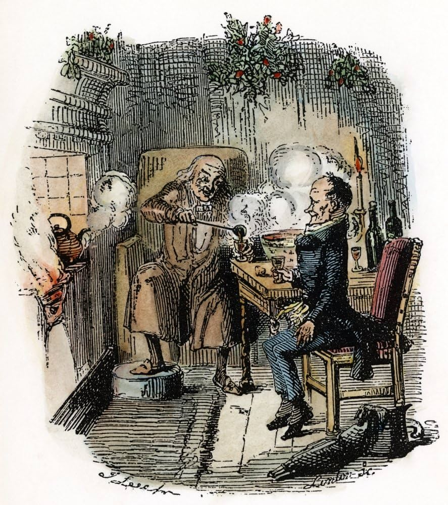

# Scrooge's Bonus

## About the game

Scrooge's Bonus is based on the gift-exchange game (also known as the gift exchange dilemma), a common economic game theory model introduced by George Akerlof and Janet Yellen to simulate reciprocacy in labor relations. It serves as a valuable tool for understanding the principal-agent problem in labor economics.

Here is an overview of the gift-exchange game and its structure, providing context for the Scrooge's Bonus game:

While the simplest form of the general gift-exchange game typically involves only two players—Scrooge and an employee—the Scrooge's Bonus game, which is a themed implementation of the gift-exchange dilemma, uses a multi-player format for the ABS Data Engineers' Challenge. The game proceeds sequentially:
1. Scrooge's Move (The Gift): Scrooge first decides whether to award a bonus (the "turkey") or give no bonus.
2. Employee's Move (The Reciprocation): Employees then individually decide whether to reciprocate the bonus choice with a higher level of effort (work harder) or a lower level of effort.

This sequence continues for a number of rounds. 

The core concept the game investigates is reciprocity. The theory suggests that if Scrooge offers a higher salary, employees are more inclined to reciprocate with greater effort, leading to mutually beneficial outcomes. Reciprocity is a fundamental factor that shapes individuals' behavior in economic contexts, demonstrating that self-interest maximization is not the sole determinant of economic decision-making.

<p align="center">
  
</p>

## Quick start

- Open and run run_game.ipynb to select strategies and rounds, then view the actions and scores tables plus a leaderboard.
- Helpers live in game_helpers.ipynb. Sample strategies live in sample_players.ipynb.

## Core actions

- Scrooge actions: turkey, no_turkey
- Employee actions: high, low

## Payoff matrix (Scrooge, employee)

- (turkey, high): (2, 2)
- (turkey, low): (0, 3)
- (no_turkey, high): (3, 0)
- (no_turkey, low): (1, 1)

## Build your own strategies

- Scrooge strategy signature: def scrooge(history: pd.DataFrame) -> str where history has columns scrooge_action, high_effort, low_effort.
- Employee strategy signature: def employee(history: pd.DataFrame) -> str where history additionally includes my_action.

Notes

- See sample_players.ipynb for simple baselines like generous and tit_for_tat.

## Example strategies (Python)

Here are minimal examples of a Scrooge strategy and an employee strategy you can drop into `sample_players.ipynb`:

```python
import pandas as pd

def tit_for_tat_scrooge(history: pd.DataFrame) -> str:
    """Start generous; if anyone shirked last round (low_effort > 0) give no turkey."""
    if history.empty:
        return "turkey"
    last_round = history.iloc[-1]
    return "turkey" if last_round["low_effort"] == 0 else "no_turkey"

def opportunistic_employee(history: pd.DataFrame) -> str:
    """Work hard only when the previous round included a turkey."""
    if history.empty:
        return "high"
    return "high" if history.iloc[-1]["scrooge_action"] == "turkey" else "low"
```

Running a single match programmatically:

```python
%run game_helpers.ipynb

result = run_match(
    scrooge_fn=tit_for_tat_scrooge,
    employee_fn=opportunistic_employee,
    rounds=4,
)

result.history  # pandas DataFrame of round-by-round outcomes
result.employer_total, result.employee_total
```

## Example history inputs to strategies

During simulation, each strategy receives a view of past rounds.

History passed to Scrooge strategies (columns: `scrooge_action`, `high_effort`, `low_effort`):

| round | scrooge_action | high_effort | low_effort |
|------:|-----------------|------------:|-----------:|
| 1     | turkey          | 2           | 0          |
| 2     | no_turkey       | 1           | 1          |
| 3     | no_turkey       | 0           | 2          |

History passed to Employee strategies (columns: `scrooge_action`, `my_action`, `high_effort`, `low_effort`):

| round | scrooge_action | my_action | high_effort | low_effort |
|------:|-----------------|-----------|------------:|-----------:|
| 1     | turkey          | high      | 2           | 0          |
| 2     | no_turkey       | high      | 1           | 1          |
| 3     | no_turkey       | low       | 0           | 2          |


